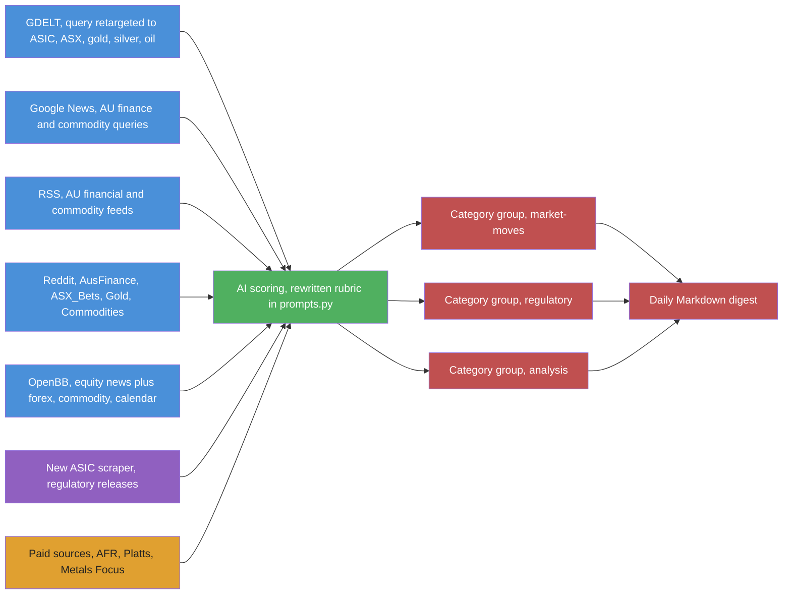
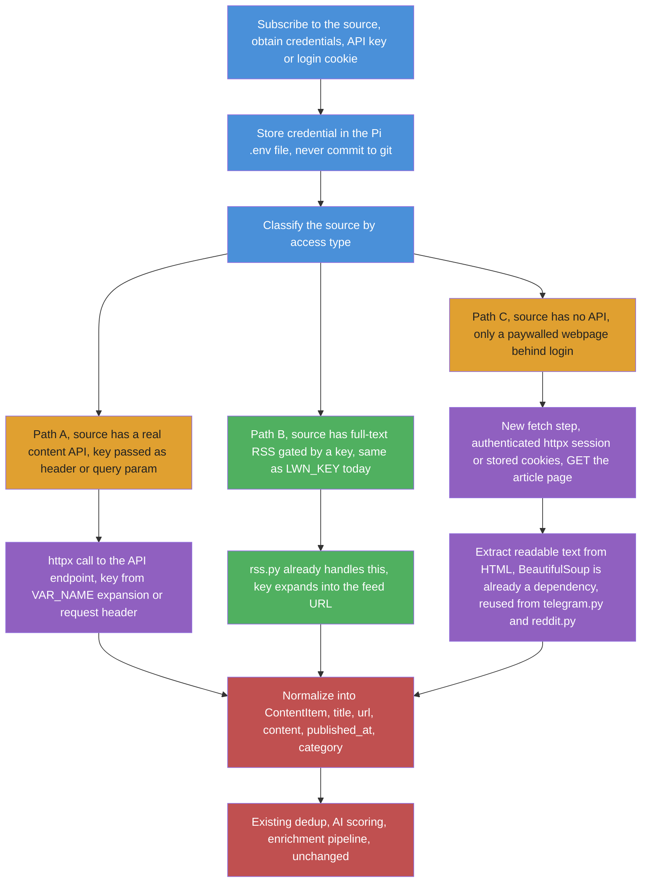
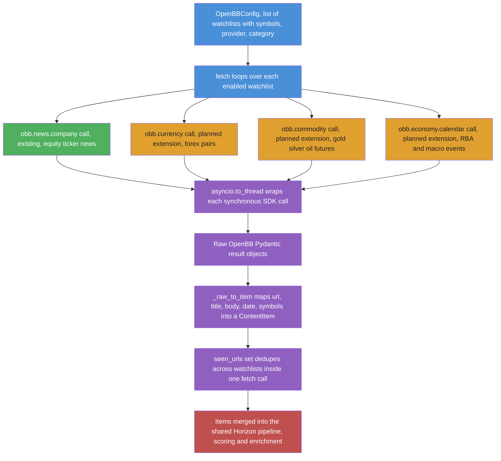
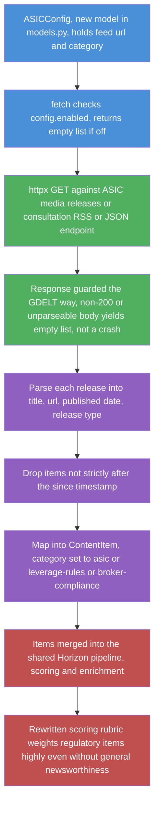
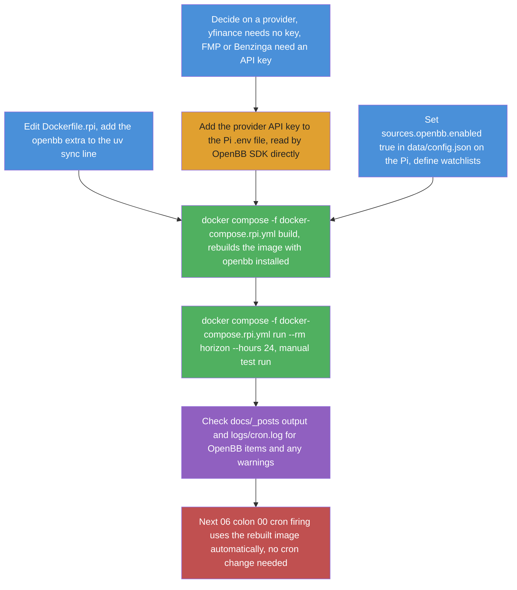
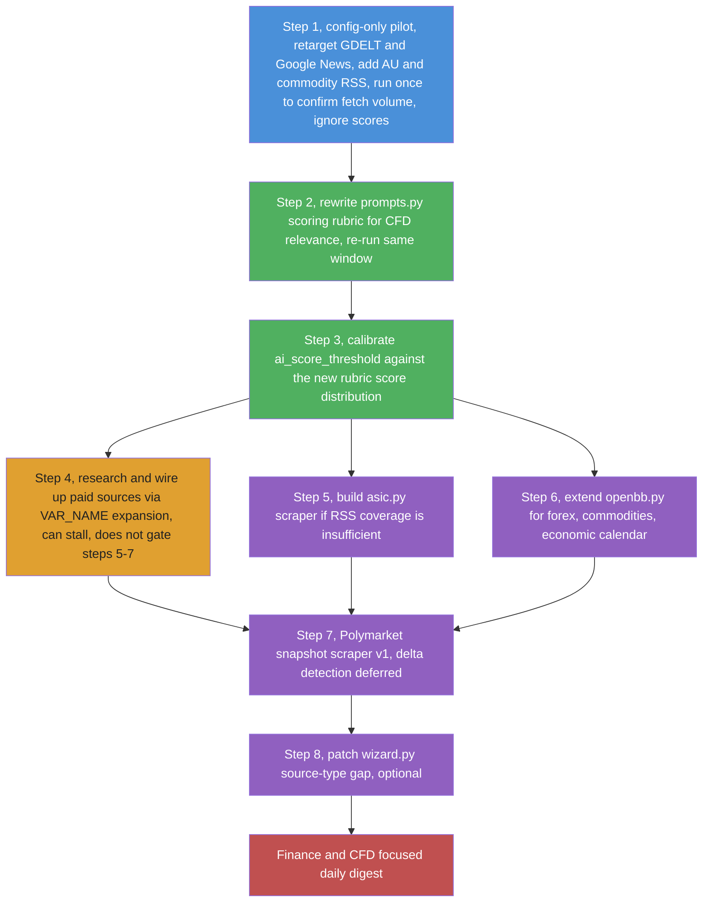
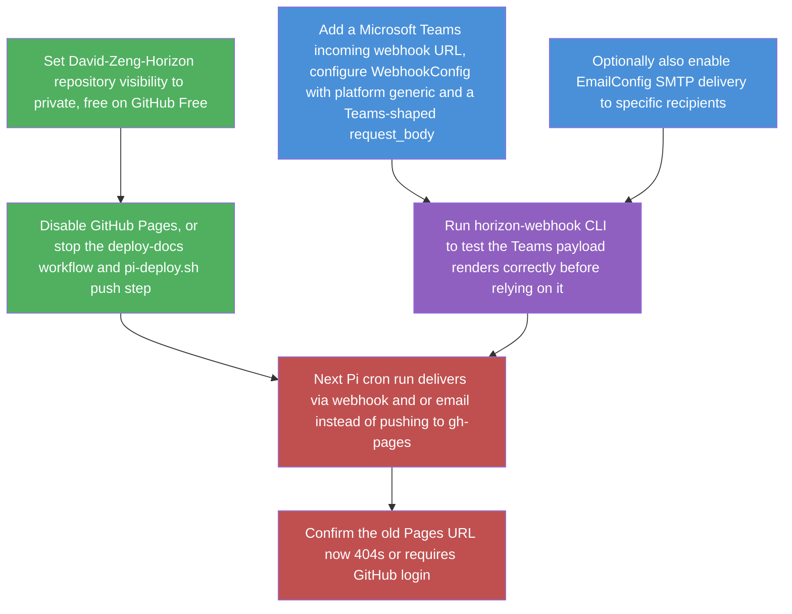
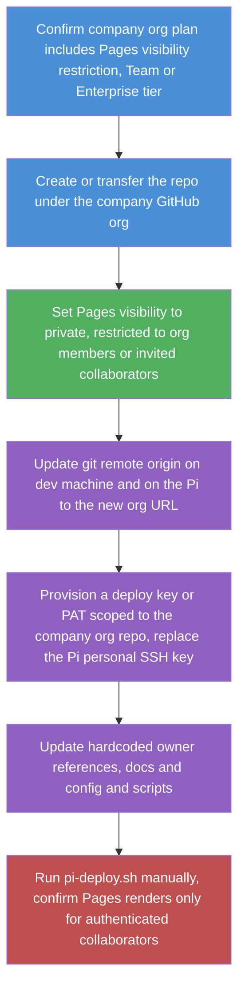
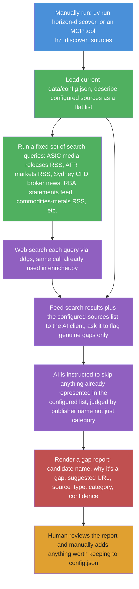
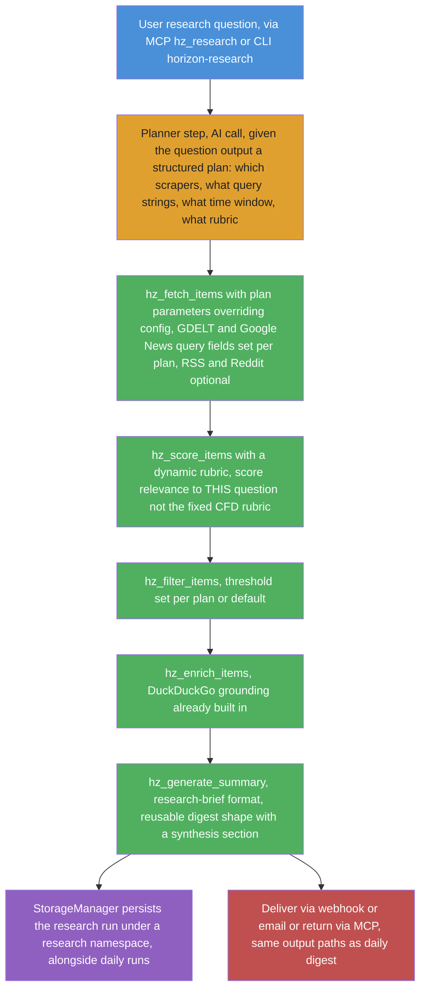

Plan: Pivoting Horizon to Sydney CFD Market & Regulatory News

**Status: planning only — nothing in this document has been implemented yet.**

## Goal

Retarget Horizon from AI/tech news aggregation to a daily briefing focused on:

1. **Sydney/ASX-area CFD market news** — price-moving events for CFD-traded instruments (ASX indices, AUD forex pairs, commodities relevant to the Australian market).
2. **Regulatory change tracking** — ASIC (Australian Securities & Investments Commission) CFD rules, leverage caps, margin requirements, broker compliance actions, and related APAC regulatory news (since ASIC CFD rules are closely watched alongside ESMA/FCA precedent).
3. **Broader financial review coverage** — sourced from existing config-driven scrapers plus new sources, including paid/subscription financial outlets where needed for depth.

This document is the result of a codebase investigation (see prior conversation) into what's config-only vs what needs code changes, extended with concrete sourcing and a phased build-out.

## Why this is a pivot, not a fork

Nothing in `src/` hardcodes "AI/tech" at the architecture level — the scrapers, dedup, storage, and output layers are topic-agnostic. The coupling is concentrated in three places:

- `src/ai/prompts.py` — scoring/enrichment rubric text (Python constants, no config override)
- `src/setup/wizard.py` — `build_config()` source-type coverage gap
- `src/scrapers/openbb.py` — financial scraper exists but is equity-news-only

Everything else is config (`data/config.json`) or new scraper modules following the existing `BaseScraper` pattern.

## Target topic model

Three category groups, mapped to `filtering.category_groups` (already a working, generic mechanism per `docs/scoring.md`):

|Group|Categories|Purpose|
|-|-|-|
|`market-moves`|`asx`, `forex-aud`, `commodities-metals`, `commodities-energy`, `indices-cfd`|Price-relevant news for CFD-traded instruments|
|`regulatory`|`asic`, `leverage-rules`, `broker-compliance`|ASIC/regulator actions, rule changes, enforcement|
|`analysis`|`broker-research`, `macro-review`, `financial-press`|Reviews, commentary, macro context|



## Source plan

### Reuse as-is (config-only retarget)

|Scraper|Change needed|Notes|
|-|-|-|
|`gdelt`|`query` → `"ASIC CFD"`, `"ASX"`, `"RBA interest rate"`, `"AUD forex"`, `"gold price"`, `"silver price"`, `"oil price WTI Brent"`|Best existing lever for macro/regulatory event coverage; GDELT indexes global news including AU regulatory press and commodity markets. **Single-query limitation:** `GDELTConfig` (`models.py:269-286`) holds one `query: str`, and `SourcesConfig.gdelt` is `Optional[GDELTConfig]` (line 317), not a list — the orchestrator instantiates exactly one `GDELTScraper` (`orchestrator.py:307`). Multiple queries therefore require either (a) a single compound query string (quick path, no code change, but GDELT's boolean syntax has complexity limits), or (b) changing `sources.gdelt` to `List[GDELTConfig]` in `models.py` + looping in `orchestrator.py` (small code change, cleanest result). Decide before the config-only pilot — see Code changes below|
|`google_news`|`query` → `"CFD trading Australia"`, `"ASIC margin rules"`, `"ASX 200"`, `"gold silver spot price"`, `"crude oil OPEC"`; `country: "AU"`, `ceid` set to AU/en|Mainstream financial journalism, config-only|
|`rss`|Replace existing tech feeds with AU financial + commodity RSS (see below)|Zero code change — just new feed entries|
|`reddit`|Swap `MachineLearning` etc. for `r/ASX_Bets`, `r/AusFinance`, `r/Forex`, `r/Gold`, `r/Silverbugs`, `r/Commodities`|**Signal-to-noise is materially worse than tech subs** — `r/ASX_Bets` is meme-heavy; high-engagement posts are often jokes, not analysis, and native analysis posts rarely break 50 upvotes. The default `min_score: 10` (`config.example.json:66`) will flood the pipeline with noise that burns AI scoring tokens on memes. Recommended starting values: `min_score: 100`, `fetch_limit: 5` for `r/ASX_Bets`; `min_score: 50` for `r/AusFinance`/`r/Forex`/`r/Gold`. Treat Reddit as a tertiary canary (crossposted announcements already covered by RSS), not a primary source|
|`openbb`|Repoint `watchlists[].symbols` to ASX-listed tickers / AUD pairs / metals-and-energy proxy tickers (e.g. `GC=F`, `SI=F`, `CL=F` if `news.company()` accepts futures symbols) if accepted (needs empirical check — see Gaps)|Still equity-news-shaped; see code changes below for real CFD coverage|
|`twitter`|Swap handles to AU finance commentators/ASIC/RBA accounts, plus commodity-desk analysts, if Twitter scraper is enabled|Optional, lower priority|
|`github`, `hackernews`, `ossinsight`|Disable|No finance angle; HN is structurally tech-biased and can't be retargeted|

### New RSS sources to add (free, config-only)

**Token-cost note:** the current pipeline processes ~20-40 items/day (the 2026-05-31 example shows 21 fetched, 14 above threshold). The new source mix (GDELT at up to 75 records + Google News at up to 100 + RSS + Reddit + OpenBB + ASIC) could produce 200-400 items/day before scoring. At `analysis_concurrency: 1` with DeepSeek (~$0.14/M input, ~$0.28/M output), a rough budget: 200 items × ~3K tokens (analysis + enrichment for top N) ≈ 600K tokens/day ≈ $0.10-0.15/day — affordable, but the enrichment pass (2nd AI call with DuckDuckGo web-search context for top-scored items) is the expensive step and scales with `ai_score_threshold` (lower threshold → more items enriched → higher cost). Worth checking the actual item volume after step 1 before assuming the budget holds. If volume is higher than expected, consider raising the threshold or capping enrichment to the top 15-20 items.

These are standard AU financial RSS feeds — add as new entries under `sources.rss` in config, no code change:

- ASX market announcements (company announcements platform — check ASX's public feed availability)
- RBA (Reserve Bank of Australia) media releases — rate decisions are the single biggest AUD/ASX CFD driver
- AFR (Australian Financial Review) — markets section RSS (subscription may gate full text, see Paid sources below)
- Investing.com Australia / ForexLive — global FX-focused, config-only addition
- ASIC media releases RSS (regulatory actions, consultation papers, enforcement)

Commodity-specific feeds (gold, silver, oil, and other large-volume CFD-traded merchandise):

- Kitco News — gold/silver/precious metals spot price news and commentary, widely used by metals CFD traders
- World Gold Council press releases — official gold-market data and demand trends
- OilPrice.com — crude oil (WTI/Brent), natural gas, energy-sector CFD-relevant news
- EIA (US Energy Information Administration) — weekly petroleum/inventory reports, a major oil-price catalyst
- LME (London Metal Exchange) news/announcements — base metals (copper, aluminium, nickel) pricing context, relevant to broader commodities-CFD coverage
- Reuters Commodities RSS (if available) / Mining.com — diversified commodity-merchant coverage (mining majors, bulk metals, agri where CFD-relevant)

*(Exact feed URLs need verification at implementation time — RSS endpoints change and some require checking robots.txt/ToS before scraping.)*

### Paid/subscription sources (needs research + possible new integration)

The user flagged that some financial reviews and local news may require payment for full context. Candidates:

- **AFR (Australian Financial Review)** — subscription paywall; RSS may only give headlines/excerpts. Full-text would need either an API (if AFR offers one) or accepting headline-only items.
- **The Australian / Business section** — similar paywall situation.
- **Bloomberg/Reuters terminals or APIs** — enterprise pricing, likely out of scope for a personal aggregator but worth listing as an option if budget allows.
- **Morningstar / IBISWorld** — paid research, relevant for "financial reviews" angle.
- **Metals Focus / CPM Group (precious metals research)** — paid gold/silver supply-demand and price-forecast reports, used by serious metals CFD desks.
- **S&P Global Commodity Insights (Platts)** — paid oil/gas/energy and broader commodity pricing and assessment data, an industry-standard "large merchant" source for energy/commodity CFDs.

For paywalled sources, the codebase already has one reusable integration pattern: the `${VAR_NAME}` config expansion (used today for `LWN_KEY` in `config.example.json:52`) — if a source exposes an API key for full-text RSS, this is a drop-in, no-code path. This needs to be assessed per source once you know which subscriptions you're willing to pay for.

### Beyond financial reviews: other paid-context categories worth considering

Financial-review outlets (AFR, The Australian) are the hardest paid category to integrate well, because they're Path C by default (paywalled prose, no API). The categories below are generally **easier** to wire up — they're data/API-first businesses, so Path A (a real content API) is the common case rather than the exception, and the output is usually structured data the AI can reason over directly rather than HTML that needs extraction.

- **Real-time/historical market data APIs** — e.g. Polygon.io, Twelve Data, Alpha Vantage premium tiers, IG/OANDA market-data APIs. These are exactly the kind of "large amount merchant" data feeds already on the radar via OpenBB's provider system (`OpenBBWatchlist.provider` already supports swapping providers per watchlist — `models.py:225`). A paid tier mainly buys higher rate limits and broader instrument coverage (forex pairs, indices, commodities) rather than a different integration shape — straightforward Path A once `openbb.py` is extended per the earlier `obb.currency`/`obb.commodity` plan.
- **Broker-grade economic calendars** — e.g. Trading Economics, Forex Factory premium, DailyFX calendar API. These directly serve the "regulatory and macro changes" goal (RBA decisions, CPI prints, employment data) with structured event data (time, actual/forecast/previous values, impact rating) rather than prose — arguably higher-value-per-dollar than a news subscription, since `obb.economy.calendar` (already identified as a planned OpenBB extension) may pull from one of these providers depending on which OpenBB provider extension is installed.
- **Regulatory/compliance databases** — e.g. RegTech feeds, LexisNexis regulatory tracking, or ASIC's own paid "Connect" data services (beyond the free media-release RSS already planned). Relevant if the free ASIC media releases prove too sparse or delayed compared to a paid regulatory-monitoring service — worth treating as a fallback/upgrade to the planned `asic.py` scraper rather than a day-one requirement.
- **Alt-data / sentiment feeds** — e.g. Benzinga Pro (already partially in scope — `openbb-benzinga` is pinned in `pyproject.toml:32` as a news provider), StockTwits/social-sentiment APIs, or broker order-flow/positioning data (e.g. IG client sentiment, which several CFD brokers publish free or paid) — useful as a "what are other CFD traders doing" signal layered on top of news, though this is a genuinely new data shape (sentiment scores, not articles) and would need its own `ContentItem.metadata` convention rather than fitting the existing title/url/content shape cleanly.
- **Prediction markets** — see dedicated subsection below.

**Why these are generally a better first paid investment than a news subscription:** all categories above are typically Path A (real API, structured JSON, official rate-limited access) rather than Path C (cookie auth, HTML scraping, ToS risk). They also map directly onto work already planned — the OpenBB extension (`obb.currency`/`obb.commodity`/`obb.economy.calendar`) and the ASIC scraper — rather than requiring a brand-new scraper category. A financial-review subscription, by contrast, is likely to land in Path C and cost more in ongoing scraper maintenance than the subscription itself costs in money.

### Prediction markets (Polymarket and similar) as alt-data

Polymarket is a candidate for this pipeline specifically because, unlike most of the paid sources above, it's genuinely **free and keyless** — making it a faster win than anything on the paid list *on the access dimension*, though the data-shape work (below) means it's not a zero-effort addition. It belongs in a later phase (step 7 of the phased order), not the config-only pilot.

- **Access**: Polymarket's Gamma API (market metadata, descriptions, categories) and CLOB API (live order-book prices, i.e. the market's implied probability) are both public REST endpoints with no API key required for read access — this is closer to Path A than even the `LWN_KEY` RSS case, since there's no credential-management step at all. A new `src/scrapers/polymarket.py` would follow the `gdelt.py` shape: `httpx.AsyncClient` GET against the public endpoint, map JSON results into `ContentItem`.
- **Why it's relevant to a CFD/macro briefing**: prediction-market odds are a leading indicator for exactly the events this plan already cares about — RBA rate-decision odds, inflation-print outcome odds, election/geopolitical-event odds that move forex and commodities, even odds on specific regulatory actions if a market exists for them. This is a different *kind* of signal than news (a crowd-sourced probability rather than a reported fact), which is genuinely additive rather than duplicating GDELT/Google News coverage.
- **Data shape mismatch to plan for**: a Polymarket market is fundamentally a "current probability for outcome X" snapshot, not a discrete news event with a single `published_at`. Mapping it into `ContentItem` means treating each fetch as a new "item" representing the market's state at fetch time (title = market question, content = current odds/volume/recent movement, `published_at` = fetch time or last-trade time) — similar in spirit to the alt-data sentiment-feed mismatch noted above, and likely wants its own `metadata` convention (e.g. `probability`, `volume_24h`, `price_change`) rather than reusing news-style fields. **v1 should be snapshots-only** (current odds at fetch time). "Odds moved significantly" (a delta) is more useful to surface than a raw snapshot, but requires the scraper to persist the previous reading and diff against it — new state-tracking the rest of the pipeline doesn't currently do (`StorageManager` tracks seen items for dedup, not numeric time series). Defer delta detection to v2; a snapshot-only v1 is still additive as alt-data context.
- **Other prediction markets worth the same treatment**: Kalshi (CFTC-regulated, US-based, also has a public API, arguably more relevant for US macro events that move global CFD instruments) and Metaculus (forecasting community, no real-money trading, API-accessible) are structurally similar alt-data candidates if Polymarket proves useful.
- **Scoring rubric implication**: if this is built, the `prompts.py` rewrite (already planned) should explicitly account for probability-snapshot items reading differently from news items — the AI needs to know "AUD rate-cut odds moved from 40% to 65% overnight" is the kind of signal worth a high score, distinct from how it scores a news article.
- **Dedup edge case**: a Polymarket snapshot and a news article about the *same event* (e.g. an RBA rate hold) have different URLs and semantically different content (a report of what happened vs. a snapshot of what the market thinks will happen). The AI topic-dedup step (`orchestrator.py:433-504`, prompt at `prompts.py:8-21`) asks the AI to identify "the exact same real-world event" — this may incorrectly merge a news item with its corresponding Polymarket odds item, losing the alt-data signal. Polymarket items should be tagged with a `metadata["item_kind"]: "prediction-snapshot"` flag and **excluded from topic dedup**, or the dedup prompt should be taught to treat prediction-snapshot items as non-duplicate with news items about the same event.

### Paid-source pipeline in detail: key → fetch → LLM-readable text

The `LWN_KEY` pattern only covers the easy case (a source that takes a key as a URL query param on its own RSS feed). Most paywalled financial sources won't be that simple, so the realistic pipeline has three stages, and which stage a given source needs depends entirely on what it offers.



Green is what already works unmodified (`rss.py` + `${VAR_NAME}`). Orange/purple are new work, and the amount of new work depends entirely on which path a given paid source falls into:

**Path A — source has a real content API (best case).** Some providers (S&P Global/Platts, Morningstar, certain Bloomberg/Reuters tiers) offer a proper REST API with a key, separate from any RSS feed. This needs a small new scraper module (same shape as `gdelt.py`): `httpx.AsyncClient` call to the API endpoint, key read via `${VAR_NAME}` expansion in a config field or passed as an `Authorization` header (the env var itself stays out of config, same as OpenBB's credential handling). Output is usually already-structured JSON, so the `_raw_to_item` mapping step is straightforward — no HTML parsing needed.

**Path B — source has full-text RSS gated by a key (already solved).** This is the `LWN_KEY` case: the key is a query-string token appended to an otherwise-normal RSS feed URL. `rss.py:69-73` already does this expansion. Zero new code — just add the feed under `sources.rss` with `${VAR_NAME}` in the URL and the key in `.env`. Worth checking each paywalled candidate for this option first, since it's free to implement.

**Path C — source has no API, content sits behind a logged-in webpage (worst case, and the likely reality for AFR/The Australian).** This is the scenario the user is flagging by "use a scraping tool to get context the LLM can read." Concretely:

1. **Authentication** — most paywalled news sites use session cookies, not API keys, for logged-in access. This means either (a) a stored, periodically-refreshed cookie file (the same pattern `twitter_playwright.py` already uses — see `docs/twitter-cookies.md` and `TwitterConfig.cookie_dir`/`cookie_file_pattern` in `models.py`), or (b) a Playwright-driven login flow that signs in with stored credentials and exports cookies, since most paywalls render content client-side or check auth server-side per-request.
2. **Fetching the article page** — once authenticated, fetch the actual article URL (from the free/headline-only RSS or Google News item) with the authenticated session, rather than the public RSS summary.
3. **Extracting readable text from the HTML** — `BeautifulSoup` is already a project dependency (`pyproject.toml:20`, used in `telegram.py:69` and `reddit.py:200,421`), so this is a pattern extension, not a new library. The extraction logic itself (find the article body element, strip ads/nav/related-links cruft) is paywall-specific and brittle — it breaks whenever the site redesigns, which is a real maintenance cost worth being honest about up front.
4. **Mapping into `ContentItem`** the same way every other scraper does — `content` becomes the extracted full text instead of an RSS summary, everything downstream (dedup, scoring, enrichment) is unchanged.

**Worked example — AFR (Australian Financial Review):**

- AFR publishes a free public RSS feed (markets/companies sections) but it almost certainly returns headline + a short teaser, not full article text, for subscriber-only stories — that's the standard paywall RSS pattern.
- Check Path A first: AFR's parent (Nine Entertainment) has not been observed to offer a public developer/content API in this research; this needs an actual check (search "AFR API for developers" / "Nine Entertainment content API") before ruling it out — don't assume Path C without looking.
- Check Path B next: if AFR's RSS accepts a subscriber token as a URL parameter the way LWN does, that's the cheapest win — worth testing with an active subscription before building anything.
- If both come up empty, Path C applies: a personal AFR subscription's session cookie (captured via a one-time Playwright login, following the existing `twitter_playwright.py` cookie pattern) would let a new scraper fetch the full article HTML for URLs already discovered via the free RSS/Google News teaser, then extract the body text with BeautifulSoup.
- Caveat to flag explicitly: AFR's Terms of Use govern automated access to subscriber content distinctly from public pages — this should be read before building Path C for AFR specifically, since "I have a personal subscription" does not automatically mean "scripted scraping of my own paid access is permitted." This is the kind of per-publisher ToS check the sequencing recommendation below calls out.

**Sequencing recommendation:** for each paid source on the candidate list, check Path A then Path B before assuming Path C. Path C should be a last resort — it's the most fragile, the most ToS-sensitive (scraping a logged-in paywalled page is a materially different legal posture than reading public RSS, worth checking each publisher's terms before building), and the most ongoing-maintenance-heavy. It's plausible several "needs research" candidates (Platts, Morningstar, IBISWorld) turn out to be Path A once you actually look at their developer docs, leaving Path C only for outlets that genuinely have no API offering.

### Legal considerations for Path C scraping (read before building)

Path C (authenticated scraping of paywalled publisher content) is the **highest-risk activity in this entire plan** and deserves its own treatment rather than being buried in a worked example. Key points:

- **Personal subscriptions do not automatically grant automated-access rights.** AFR (Nine Entertainment) and The Australian (News Corp AU) have legal departments that actively enforce ToS against commercial scraping. "I have a personal subscription" is not the same as "my subscription permits scripted fetching of subscriber-only content" — most publisher ToS distinguish human reading from automated access explicitly.
- **Australian copyright law's fair dealing provisions** for news reporting may apply to AI-aggregation use cases, but this is largely untested for LLM-mediated re-summarization of paywalled content. Don't assume fair dealing covers this without a legal opinion.
- **The legal posture differs by path**: Path A (licensed API, you pay for structured access) and Path B (key-gated RSS, the publisher designed this access method) are publisher-sanctioned. Path C (cookie-scraping a page the publisher did not expose for automation) is not sanctioned, regardless of whether you hold a subscription.
- **Recommendation**: treat Path C as requiring an explicit per-publisher ToS review *before* building, not after. If a publisher's ToS prohibits automated access, accept headline-only RSS (Path B if available, else the free teaser) rather than building a scraper. The digest is still useful with headline-only items for paywalled sources — the AI can enrich them via web search (the existing `enricher.py` DuckDuckGo path) without needing the full subscriber text.

### New scraper code needed

- **ASIC regulatory feed** — if ASIC doesn't publish clean RSS, a small new scraper (`src/scrapers/asic.py`) following the `BaseScraper` pattern, similar in shape to `gdelt.py`/`google_news.py`, polling ASIC's media release / consultation pages.
- **OpenBB extension** for true CFD-relevant instrument classes — extend `src/scrapers/openbb.py` to call `obb.currency` (forex), `obb.economy.calendar` (RBA/economic calendar — directly relevant to "regulatory and macro changes"), and `obb.commodity` (gold, silver, oil, and other large-volume merchandise — OpenBB's commodity extension covers precious metals and energy futures pricing/news), alongside the existing `news.company()`. Needs new Pydantic config fields in `models.py` (current `OpenBBConfig`/`OpenBBWatchlist` assume equity-ticker semantics).

### How the OpenBB feed works today (and after extension)

`src/scrapers/openbb.py` wraps the synchronous OpenBB SDK in `asyncio.to_thread` and currently calls exactly one endpoint, `obb.news.company()`, once per configured watchlist. The diagram below shows the current path (solid styling) and the proposed forex/commodity/calendar extension (dashed-equivalent, same node style called out in the label).



Green is the call that exists in the code today. Orange are the planned additions — each needs its own thin wrapper method (mirroring `_fetch_watchlist`) plus a new `_raw_to_item`-style mapper, since the OpenBB SDK returns different result shapes per endpoint. Provider credentials (FMP, Benzinga, Polygon, etc.) are read by the OpenBB SDK from its own environment/settings, not passed through Horizon config.

### How the planned ASIC regulatory feed would work

No code exists yet. The proposed shape mirrors `gdelt.py` (a stateless poll-and-map scraper) rather than `openbb.py` (an SDK wrapper), since ASIC is just another HTTP source.



Whether ASIC needs this custom scraper at all depends on the open question below — if ASIC publishes usable RSS, the generic `rss.py` scraper handles it with zero code, and `asic.py` is unnecessary.

### Getting OpenBB running on the current Pi instance

No new server is needed — OpenBB is a local Python SDK, not a hosted service — but the **current production image does not have it installed**, confirmed by reading the live deployment files:

- `docker-compose.rpi.yml:19` builds from `Dockerfile.rpi` (the `dockerfile:` ref is line 19; line 18 is `context: .`), the image actually run daily per `docs/pi-daily-run.md`.
- `Dockerfile.rpi:11` runs `uv sync --frozen --no-dev` with no `--extra openbb` flag, so the `openbb`/`openbb-benzinga` packages declared in `pyproject.toml`'s optional `openbb` extra are never installed in the image that exists today.
- `sources.openbb.enabled` is `false` by default in `config.example.json:89`, so even if the package were present, the scraper would no-op — the `ImportError` warning at `openbb.py:71-77` fires only for the missing-package case; the disabled-source case returns an empty list silently at `openbb.py:88` (`if not self._obb or not self.openbb_config.enabled: return []`).

So "making OpenBB work" on the Pi is an image-rebuild-and-redeploy, not new infrastructure:



Concrete steps, in order:

1. **Edit `Dockerfile.rpi`** (on the Pi or pushed via the normal git-pull-then-build flow) — change `RUN uv sync --frozen --no-dev` (line 11) to `RUN uv sync --frozen --no-dev --extra openbb`. This is the only Dockerfile change needed; everything else is config/env.
2. **Pick a provider.** `yfinance` (the `config.example.json` default) needs no API key and is the lowest-friction way to confirm the pipeline works end-to-end before paying for anything. Upgrading to FMP/Benzinga/Polygon for better news coverage (or later, the planned `obb.currency`/`obb.commodity`/`obb.economy.calendar` extensions) is a config + key change, not another image rebuild, provided the package is already installed.
3. **Add the provider's API key to the Pi's `.env`** (the same file already holding AI provider keys per `docs/pi-daily-run.md:64`, which describes it generically as "API keys (AI provider, etc.) live in a `.env` file on the Pi's filesystem" — the `DEEPSEEK_API_KEY` name specifically appears in `docs/rpi-docker.md` and `docs/configuration.md`, not `pi-daily-run.md`) — OpenBB's SDK reads its own credentials from environment variables independently of Horizon's `${VAR_NAME}` config expansion, so the env var name must match what OpenBB itself expects for that provider.
4. **Flip `sources.openbb.enabled` to `true`** in the Pi's `data/config.json` (not `config.example.json` — that file is gitignored and lives only on the Pi) and define at least one watchlist with real symbols.
5. **Rebuild the image**: `docker compose -f docker-compose.rpi.yml build` (one-time after the Dockerfile edit; not needed again until the Dockerfile changes further).
6. **Manual test run** before trusting the cron job: `docker compose -f docker-compose.rpi.yml run --rm horizon --hours 24`, then check `docs/_posts` and `logs/cron.log` for OpenBB items or the "package not installed"/empty-watchlist warnings from `openbb.py`.
7. **No cron or `pi-deploy.sh` change needed** — the existing `0 6 * * *` crontab entry just invokes `docker compose run --rm horizon` against whatever image is currently built, so once the rebuilt image is in place, the next scheduled run picks it up automatically.

Note `docker-compose.rpi.yml` also defines an `ofelia` scheduler service (`horizon-scheduler` container) as an alternative to the crontab — per `docs/pi-daily-run.md` the **crontab entry is the actual live path**, not ofelia, so step 7 assumes that's still true; worth double-checking `crontab -l` on the Pi hasn't changed before assuming this.

## Code changes required

### 1. `src/ai/prompts.py` — rewrite the scoring rubric

Current `CONTENT_ANALYSIS_SYSTEM` (lines 23-60) scores for "software engineering, AI/ML, and systems research." Replace with a rubric scoring for:

- Direct price impact on ASX indices, AUD pairs, or commodity CFDs (rate decisions, earnings surprises, geopolitical shocks)
- Precious metals and energy moves specifically — gold/silver spot price swings, central bank gold buying, oil/gas supply shocks (OPEC+ decisions, EIA inventory surprises, pipeline/refinery disruptions) — these are large-volume CFD instruments and should be scored on par with ASX/forex moves, not treated as a minor category
- Regulatory changes affecting CFD trading conditions (leverage limits, margin close-out rules, product intervention orders) — these should score high even without "newsworthiness" in a general-press sense, since they directly change what's tradeable
- Macro data releases (CPI, employment, GDP) with explicit AU/global relevance
- Broker/platform-level news (outages, compliance actions, new CFD product listings) — lower priority but relevant for an active CFD trader
- Penalize generic stock-tip / promotional content, consistent with the existing "overly promotional" low-priority tier

Also update `CONTENT_ENRICHMENT_SYSTEM` (lines 102-138) and `CONCEPT_EXTRACTION_SYSTEM` (lines 84-88) — both currently frame output for a "technically-minded reader" / "technical concepts." Reframe for a financially-literate reader needing concepts like margin, leverage, basis points, spread explained instead.

**Language decision (en/zh):** the current pipeline produces bilingual output — `CONTENT_ENRICHMENT_SYSTEM` requires both `*_en` and `*_zh` fields regardless of `config.ai.languages` (which defaults to `["en"]` only in `config.example.json`). The mock-up below is English-only. Decide explicitly before the prompt rewrite: if zh is dropped (likely, since CFD sources are predominantly English — ASIC, RBA, AFR, ASX), simplify `CONTENT_ENRICHMENT_SYSTEM` to single-language and save ~50% of enrichment tokens. If zh is kept (Chinese-language CFD traders in Sydney exist), the mock-up should show it and the enrichment prompt stays bilingual. This is a one-line prompt change either way but affects every enrichment call's token cost.

### 2. `src/setup/wizard.py` — close the source-type gap (optional, only if using the interactive wizard)

`build_config()` (lines 191-291) has no branch for `openbb`/`ossinsight`/`gdelt`/`google_news`. If hand-editing `config.json` directly, this can be skipped. If you want `horizon-wizard` to support finance setup end-to-end, add the missing `elif` branches.

### 3. `src/scrapers/openbb.py` + `models.py` — broaden beyond equity news

Add methods for forex/commodity/economic-calendar OpenBB calls; extend `OpenBBConfig` to support non-equity instrument identifiers. Requires adding OpenBB extension packages to `pyproject.toml`'s `openbb` extra (currently only `openbb-benzinga` is pinned alongside core `openbb`).

### 4. New `src/scrapers/asic.py` (if no usable RSS exists)

Follow the `gdelt.py`/`google_news.py` pattern: async fetch, parse into `ContentItem`, register in `orchestrator.py` and `models.py` (new `ASICConfig`).

### 5. `src/models.py` + `src/orchestrator.py` — support multiple GDELT queries (if compound-query string proves insufficient)

If a single GDELT compound query can't cover the full topic spread cleanly (ASIC + ASX + RBA + AUD + gold + silver + oil), change `SourcesConfig.gdelt: Optional[GDELTConfig]` → `Optional[List[GDELTConfig]]` (line 317) and loop over configs in `orchestrator.py:307` where `GDELTScraper` is instantiated. This is the cleanest path to running the 7 distinct queries listed in the source table as separate fetches with their own `category` tags. Try the compound-string path first — only make this change if boolean-query complexity limits bite.

## Known architecture gap (flagged, not addressed by this plan)

The pipeline is a **digest tool** — batch fetch → AI score → daily Markdown — not a real-time feed. `ContentItem` has no price/quote fields, and there's no streaming output path. This plan deliberately stays within the digest model: regulatory changes and market-moving *news* fit it well, but live price/spread data does not. Concretely, this is a **pre-market briefing** (the 6 AM Sydney cron catches overnight US/Europe action plus the prior day's ASX/ASIC releases), not an intraday alert system — if real-time price action or intraday regulatory alerts turn out to be a hard requirement, that's a separate, much larger architectural project (new data model, new output cadence, push-notification layer) and is out of scope here unless you decide otherwise.

## Operational monitoring (silent-failure risk)

The plan covers the happy path (Pi cron → Docker → pipeline → webhook/email) but a silent failure leaves the user with no digest and no alert. Failure modes the existing pipeline doesn't notify on:

- **Container fails to start** (image corruption, Docker daemon down, disk full) — the orchestrator's webhook-failure notification (`orchestrator.py:231-237`) only fires if the orchestrator catches an exception *inside* a running container; if the container never starts, nothing notifies anyone.
- **Network down on the Pi** — no fetch, no webhook send, no alert.
- **AI provider API key expired** — fetch succeeds, scoring fails, partial or empty digest.
- **Webhook URL rotated/expired** — pipeline runs, digest generated, delivery silently dropped.

**Recommended dead-man's-switch** (lightweight, no new dependency): a separate cron entry on the Pi that runs *after* the Horizon cron (e.g. 7 AM) and checks whether `docs/_posts/` contains a file dated today. If not, it sends a direct alert (a separate webhook call, or an `logger.error` to a monitored log, or a simple email via the existing `EmailManager`). This catches container-start failures and pipeline crashes that the in-process webhook handler can't. At minimum, document the expectation that the user verifies the digest arrived each morning until a healthcheck is in place.

## Phased implementation order (for when you're ready to build)

1. **Config-only pilot** — new `data/config.json`: retarget `gdelt`/`google_news` queries, add AU financial RSS feeds, disable `hackernews`/`ossinsight`/`github`. Run once with the *existing* (unmodified) AI prompts — but only to confirm items actually fetch and the source mix returns volume (ignore the scores, which will be wrong). Don't preserve this as a baseline artifact; the tech rubric will score ASIC announcements 0-2 and that failure mode is evident from reading `prompts.py:23-60` without running it.
2. **Rewrite `prompts.py`** per above — highest leverage on output quality. Re-run the same window immediately and compare.
3. **Calibrate `ai_score_threshold`** — the old 6.0/7.0 thresholds are invalid the moment the rubric changes (a 7.0 under the CFD rubric is not comparable to a 7.0 under the tech rubric). Methodology: run the rewritten prompts on a representative 24h window, observe the score distribution across all fetched items, set the threshold to capture the desired digest size (e.g. top 10-15 items, or the score at which item count plateaus). Re-check after any subsequent rubric edit.
4. **Research and wire up paid sources** the user is willing to subscribe to (AFR, etc.) using the `${VAR_NAME}` env-expansion pattern where the source supports key-based full-text access. Note: this step can stall (subscription decisions are a blocker) — steps 5-7 can proceed in parallel once step 2 is done; step 4 only gates *those specific paid sources* in the output, not the entire digest.
5. **Build `asic.py`** scraper for regulatory tracking if RSS isn't sufficient.
6. **Extend `openbb.py`** for forex/commodities/economic-calendar once the equity-news-only baseline proves too narrow.
7. **Polymarket alt-data (snapshots-only v1)** — see the Polymarket subsection: a v1 snapshot scraper (current odds at fetch time, no delta detection) is a reasonable later-phase addition. Delta detection ("odds moved significantly") requires persisting prior readings — new state-tracking `StorageManager` doesn't currently do — and is scope creep for v1; defer.
8. **Patch `wizard.py`** only if interactive setup support is wanted.



## Output privacy: drop public GitHub Pages, push via webhook/email, make the repo private now

**Decided direction**: don't wait on a company GitHub org migration. Make the existing `David-Zeng/Horizon` repo private immediately (private repos are free on GitHub Free — no Pro/org purchase needed for this part), disable GitHub Pages output, and switch primary CFD digest delivery to webhook (e.g. a Microsoft Teams incoming webhook) and/or email, both already fully built in `src/services/`. The org migration documented further down becomes optional/deferred, only relevant later if a browsable archive site is wanted.

**There are three separate things that are public today, not one — confirmed by checking the live repo:**

1. **The output (the daily digest content)** — served publicly via GitHub Pages at `https://david-zeng.github.io/Horizon/`, built by Jekyll and pushed via `peaceiris/actions-gh-pages@v4` per `.github/workflows/deploy-docs.yml`.
2. **The source code** — `gh repo view David-Zeng/Horizon` confirms `isPrivate: false` today. Anyone can currently read `prompts.py` (exact scoring logic), the scraper source list, and any CFD-specific config or prompt changes if committed to this repo.
3. **Git history** — the `gh-pages` branch already has real commit history (`Daily Summary: 2026-05-29` through `2026-05-31` test deploys, confirmed via `git log gh-pages`). Flipping the repo private later does not retroactively un-expose anything already pushed while public — but the practical exposure here is low: `gh api repos/David-Zeng/Horizon` shows **0 forks, 0 stars, 0 watchers**, so no one else has a known copy of this history to retain after the repo goes private.

Webhook/email delivery only solves (1). Making the repo private solves (2) and stops further accumulation of (3) — which is why both moves together, not webhook alone, are the right near-term fix.



**Concrete steps:**

1. **Make the repo private now**: GitHub repo Settings → General → Danger Zone → Change visibility → Private. Free, immediate, no plan upgrade required for this step specifically.
2. **Disable the public output path**: stop `scripts/pi-deploy.sh` from pushing to `gh-pages` (comment out or remove that step from the cron invocation), and/or disable the `deploy-docs.yml` workflow. Leaving old `gh-pages` content in place after the repo goes private is fine — it inherits the repo's new private visibility — but no *new* content should be pushed there if the goal is to stop public accumulation. **Note:** the orchestrator still writes summaries to `docs/_posts/` (`orchestrator.py` writes there via the bind mount in `docker-compose.rpi.yml:23`) regardless of whether `pi-deploy.sh` pushes — so `docs/_posts/` will accumulate on the Pi's disk unbounded without the gh-pages push clearing it. Add a periodic cleanup (e.g. a cron entry or `pi-deploy.sh` step that removes files older than N days) if disk space matters on the Pi.
3. **Wire up Teams via webhook** — no code change needed. `WebhookConfig.platform` (`models.py:333`) doesn't have a literal `"teams"` branch, but `platform: "generic"` plus a custom `request_body` template (the same `#{key}`-placeholder mechanism already used for the Feishu example — note that example lives in `config.github.json:118` as `platform: "feishu"`; the `config.example.json:148-179` example is Feishu-*shaped* but labeled `platform: "generic"`) is exactly how to post to a Teams incoming webhook URL. **The Feishu interactive-card template will not render on Teams** — Teams expects either a simple `{"text": "..."}` payload or a MessageCard/Adaptive Card schema. Set `url_env` to an env var holding the Teams webhook URL (kept in `.env` on the Pi, same pattern as other secrets). A minimal tested Teams `request_body`:
   ```json
   {
     "text": "#{summary}",
     "summary": "#{message_title}",
     "themeColor": "0078D7"
   }
   ```
   For a richer card, use the Teams MessageCard schema (`@type: "MessageCard"`, `sections[]` with `facts` for per-item title/score) — but start with the simple `{"text": ...}` form and confirm it renders before investing in a card layout.
4. **Optionally also enable email** (`EmailConfig`, already SMTP/IMAP-based) for redundancy or for recipients who prefer inbox delivery over a Teams channel.
5. **Test before trusting it**: `uv run horizon-webhook` (the CLI entry point already built for exactly this) to send a test payload and confirm Teams renders it correctly, before the first real cron-triggered send.
6. **Verify the old public surface is actually closed**: load the old Pages URL from a logged-out browser and confirm it 404s (Pages disabled) or requires GitHub login (repo now private) — don't assume either change took effect without checking.
7. **Confirm upstream sync still works after going private** — `upstream` (`Thysrael/Horizon`) stays a public repo, so making `origin` (`David-Zeng/Horizon`) private doesn't change read access to it; `git fetch upstream && git merge upstream/main` (the documented sync flow in `AGENTS.md`'s Git Policy) keeps working unmodified, since fetching from a public remote needs no credentials regardless of your own repo's visibility. The thing actually worth re-checking is push: `pi-deploy.sh`'s safety guard already refuses to push if `origin` resolves to the upstream repo — that check is unaffected by visibility — but confirm the Pi's SSH credentials still authenticate correctly against `origin` once it's private (private repos enforce auth on **all** operations, including `git fetch`/`clone` by anyone other than the owner/collaborators — only relevant if any other machine/account besides the Pi and your own dev machine currently clones `origin` directly).

**Deferred / optional**: the company-org GitHub migration (private Pages via Team/Enterprise plan) detailed below remains a valid later step if a browsable archive site is wanted in addition to push-based delivery — but it's no longer a prerequisite for shipping a private CFD digest. The steps below are kept for reference if that's revisited.

### Org migration (deferred — only needed if a private browsable Pages site is wanted later)

On a **GitHub Free** plan, a GitHub Pages site is always served at a public, unauthenticated URL even from a private repo. Restricting Pages itself to authenticated collaborators requires **GitHub Pro** (personal) or a **Team/Enterprise organization** plan.



If revisited, hardcoded owner references that would need updating: `docs/_config.yml` (`url:`/`baseurl:`), `AGENTS.md`, `CLAUDE.md`, `docs/pi-daily-run.md`, `docs/rpi-docker.md`, `scripts/run-and-deploy.sh` — all currently reference `david-zeng.github.io`/`David-Zeng/Horizon`. Also re-check GitHub Actions secrets (zero configured today per the earlier audit) and `pi-deploy.sh`'s `HORIZON_FORK` safety-check env var.

## What the output actually looks like

A mock-up of one digest, built in the exact format Horizon already produces (real example: `docs/_posts/2026-05-31-summary-en.md` — same front matter, overview line, numbered ranked list, then per-item sections with `source · author · time` byline, **Background**, optional `<details>` references, optional **Discussion**, **Tags**). Only the *content* changes — title front matter, item count, and the mix of sources reflected in the bylines (`asic` · `asx-announcements` · `openbb` · `afr` · `rba` · `polymarket` · `rss` instead of `hackernews` · `reddit`). This is illustrative, not real output — it shows the shape, not actual figures.

```markdown
---
layout: default
title: "Horizon CFD Summary: 2026-06-30 (EN)"
date: 2026-06-30
lang: en
---

> From 38 items, 12 important content pieces were selected
---
1. [ASIC issues product intervention order on retail CFD leverage limits](#item-1) ⭐️ 9.0/10
2. [RBA holds cash rate at 4.10%, signals August review](#item-2) ⭐️ 9.0/10
3. [AUD/USD slides below 0.6450 as US dollar strengthens on CPI print](#item-3) ⭐️ 8.5/10
4. [Gold hits 3-week high above US$2,430/oz on safe-haven demand](#item-4) ⭐️ 8.0/10
5. [BHP shares fall 3% after iron ore guidance cut](#item-5) ⭐️ 8.0/10
6. [AFR: APRA flags capital buffer review for non-bank lenders](#item-6) ⭐️ 8.0/10
7. [Brent crude rises on OPEC+ supply cut extension](#item-7) ⭐️ 7.5/10
8. [ASX 200 closes flat as miners offset bank gains](#item-8) ⭐️ 7.0/10
9. [Polymarket: odds of August RBA rate cut jump to 61%](#item-9) ⭐️ 7.0/10
10. [Silver breaks US$30/oz, industrial demand cited](#item-10) ⭐️ 7.0/10
11. [CBA reports record Q3 home loan volume](#item-11) ⭐️ 6.5/10
12. [ASIC bans former adviser over CFD mis-selling](#item-12) ⭐️ 6.0/10
---
<a id="item-1"></a>
## [ASIC issues product intervention order on retail CFD leverage limits](https://asic.gov.au/about-asic/news-centre/find-a-media-release/2026-releases/26-xxxmr-cfd-leverage-order/) ⭐️ 9.0/10
ASIC announced a renewed product intervention order tightening leverage caps for retail CFD issuers, citing continued evidence of rapid retail losses. The order extends existing 2021 leverage ratio restrictions (30:1 major FX down to 2:1 crypto-assets) for a further five years and adds new disclosure requirements for negative balance protection. This directly affects every CFD broker operating in the Sydney market and is the single highest-impact regulatory item this period for anyone trading or issuing local CFD products.
asic · ASIC Media · Jun 30, 09:12
**Background**: ASIC's product intervention power (s1023D Corporations Act) has been used against retail CFDs since 2021. This is the first renewal decision since then, following a public consultation that closed in March.
**Tags**: `#ASIC`, `#regulatory`, `#CFD`, `#leverage`, `#product-intervention`
---
<a id="item-2"></a>
## [RBA holds cash rate at 4.10%, signals August review](https://www.rba.gov.au/media-releases/2026/mr-26-12.html) ⭐️ 9.0/10
The Reserve Bank of Australia held the cash rate steady at its June meeting, in line with market expectations, but the accompanying statement softened language on inflation persistence, raising the odds of a cut at the August meeting. AUD CFD and forex traders should watch the August 5 meeting closely given the shift in forward guidance.
rba · RBA Media · Jun 30, 14:35
**Background**: The cash rate has been held at 4.10% since February. Markets had priced roughly a 35% chance of a hold-with-dovish-tilt outcome going into this meeting.
**Tags**: `#RBA`, `#interest-rates`, `#AUD`, `#monetary-policy`
---
<a id="item-3"></a>
## [AUD/USD slides below 0.6450 as US dollar strengthens on CPI print](https://www.afr.com/markets/currencies/aud-usd-falls-on-us-cpi-20260630-xxxxx) ⭐️ 8.5/10
*(AFR, subscriber content — full text via paid-source pipeline)* The Australian dollar fell to a five-week low against the US dollar after a hotter-than-expected US CPI print reduced the odds of near-term Fed rate cuts. AFR's markets desk notes this is the third consecutive session of AUD weakness, with technical support now being tested near 0.6400 — a level relevant to forex-CFD stop placement.
afr · AFR Markets Desk · Jun 30, 11:48
**Background**: AUD/USD had been range-bound between 0.6450-0.6600 for most of June prior to this move.
**Tags**: `#AUDUSD`, `#forex-cfd`, `#afr`, `#paid-source`
---
<a id="item-4"></a>
## [Gold hits 3-week high above US$2,430/oz on safe-haven demand](https://www.investing.com/commodities/gold-news) ⭐️ 8.0/10
Spot gold climbed to a three-week high as escalating Middle East tensions drove safe-haven flows, with CFD volumes on gold spiking in early Asian trade. Silver and platinum also gained, though gold remains the dominant commodity-CFD instrument by retail volume locally.
rss · Investing.com Commodities · Jun 30, 06:20
**Background**: Gold has traded in a US$2,350-2,420 range since mid-May; this is the first close above US$2,430 since early June.
**Tags**: `#gold`, `#commodities-metals`, `#safe-haven`, `#CFD`
---
<a id="item-5"></a>
## [BHP shares fall 3% after iron ore guidance cut](https://simplywall.st/stocks/au/materials/asx-bhp/bhp-group) ⭐️ 8.0/10
BHP shares fell sharply after the company trimmed FY26 iron ore production guidance, citing weather disruption at Pilbara operations. As the largest-weighted ASX CFD instrument by retail trading volume, BHP moves are disproportionately relevant to the local CFD market regardless of broader index direction.
openbb · yfinance · Jun 30, 10:05
**Background**: BHP is the largest constituent of the ASX 200 materials sector and one of the most heavily CFD-traded local equities.
**Tags**: `#BHP`, `#ASX`, `#iron-ore`, `#equities-cfd`
---
<a id="item-6"></a>
## [AFR: APRA flags capital buffer review for non-bank lenders](https://www.afr.com/companies/financial-services/apra-non-bank-capital-20260629-xxxxx) ⭐️ 8.0/10
*(AFR, subscriber content)* APRA signalled a review of capital buffer requirements for non-bank lenders amid rising mortgage arrears, a regulatory development distinct from but adjacent to ASIC's CFD-specific actions — relevant for traders watching financial-sector CFDs and ASX-listed lenders.
afr · AFR Regulatory · Jun 29, 16:50
**Background**: APRA regulates prudential standards separately from ASIC's market-conduct remit; the two bodies' actions are often conflated but cover different risk categories.
**Tags**: `#APRA`, `#regulatory`, `#non-bank-lending`, `#afr`, `#paid-source`
---
<a id="item-7"></a>
## [Brent crude rises on OPEC+ supply cut extension](https://oilprice.com/Energy/Crude-Oil/) ⭐️ 7.5/10
Brent crude rose over 2% after OPEC+ confirmed an extension of voluntary supply cuts through Q3, lifting energy-CFD instruments broadly. WTI followed with a smaller gain given divergent US inventory data released the same day.
rss · OilPrice.com · Jun 30, 03:15
**Background**: OPEC+ had been expected to taper cuts gradually; this extension surprised markets pricing a partial unwind.
**Tags**: `#oil`, `#commodities-energy`, `#OPEC`, `#CFD`
---
<a id="item-8"></a>
## [ASX 200 closes flat as miners offset bank gains](https://www.marketindex.com.au/asx200) ⭐️ 7.0/10
The ASX 200 closed roughly unchanged as weakness in materials (tracking the BHP guidance cut) offset gains in the financial sector following stronger-than-expected bank earnings updates.
rss · Market Index · Jun 30, 16:15
**Background**: The ASX 200 has been range-bound between 8,100-8,300 for the past two weeks.
**Tags**: `#ASX200`, `#indices-cfd`, `#market-wrap`
---
<a id="item-9"></a>
## [Polymarket: odds of August RBA rate cut jump to 61%](https://polymarket.com/event/rba-august-decision) ⭐️ 7.0/10
Prediction-market odds for an August RBA rate cut rose sharply following the softer language in today's RBA statement, up from 38% a week ago. This is a leading sentiment indicator, not a news event — included as alt-data context for traders positioning ahead of the August 5 decision rather than as a standalone story.
polymarket · Gamma API snapshot · Jun 30, 15:02
**Background**: Polymarket odds are continuously updated; this figure is a snapshot at fetch time, not a fixed historical fact like a news article.
**Tags**: `#polymarket`, `#alt-data`, `#RBA`, `#prediction-market`
---
<a id="item-10"></a>
## [Silver breaks US$30/oz, industrial demand cited](https://www.kitco.com/news/) ⭐️ 7.0/10
Silver crossed US$30/oz for the first time this quarter, with analysts citing strong industrial/solar-panel demand alongside the broader precious-metals safe-haven bid.
rss · Kitco News · Jun 30, 05:40
**Background**: Silver had underperformed gold for most of 2026 before this catch-up move.
**Tags**: `#silver`, `#commodities-metals`, `#industrial-demand`
---
<a id="item-11"></a>
## [CBA reports record Q3 home loan volume](https://www.commbank.com.au/articles/newsroom/) ⭐️ 6.5/10
Commonwealth Bank reported record quarterly home loan settlements, beating analyst expectations and lifting financial-sector sentiment on the ASX.
openbb · yfinance · Jun 30, 09:50
**Background**: CBA is the largest ASX-listed bank by market cap and a heavily CFD-traded financial instrument.
**Tags**: `#CBA`, `#ASX`, `#banking`, `#equities-cfd`
---
<a id="item-12"></a>
## [ASIC bans former adviser over CFD mis-selling](https://asic.gov.au/about-asic/news-centre/find-a-media-release/2026-releases/26-xxxmr-adviser-ban/) ⭐️ 6.0/10
ASIC permanently banned a former financial adviser for mis-selling high-leverage CFD products to retail clients without adequate risk disclosure — a smaller enforcement action than item 1, but part of the same regulatory pattern worth tracking for compliance-relevant CFD news.
asic · ASIC Media · Jun 30, 08:30
**Background**: This is an individual enforcement action under ASIC's banking and finance conduct powers, separate from the broader product intervention order in item 1.
**Tags**: `#ASIC`, `#enforcement`, `#CFD`, `#regulatory`
---
```

Notable shifts from the current AI/tech format, visible directly in the mock-up above:

- **Bylines carry the new source mix**: `asic`, `rba`, `afr`, `openbb`, `polymarket` alongside the existing `rss` — replacing `hackernews`/`reddit`/`github` as the dominant attributions.
- **Paid-source items are flagged inline** (`*(AFR, subscriber content...)*` prefix, `#afr`/`#paid-source` tags) so a reader can tell at a glance which items came through the Path A/B/C paid pipeline versus free sources — this convention doesn't exist today and would need adding to the summarizer prompt.
- **Regulatory items rank highest** (ASIC, RBA at 9.0) — reflecting `prompts.py`'s rewritten scoring criteria favoring regulatory/rate-decision impact over the current AI/tech "interesting to engineers" framing.
- **Polymarket items read differently in kind** — phrased as a snapshot ("odds rose to 61% as of fetch time") rather than a discrete event, with an explicit note in the Background field flagging it as time-sensitive alt-data, not a fixed historical fact — the schema/semantic mismatch flagged earlier in this document, handled here at the prompt/template level rather than a data model change.
- **No HN-style Discussion section** for most items, since most CFD-relevant sources (ASIC, RBA, AFR, OpenBB) don't have a comment-thread equivalent — only RSS/Reddit-style sources would retain that field; it would simply be omitted (as already happens for `rss`-sourced items in the current format, see item 8 above in the real example).
- **Item volume composition differs**: where the current digest is HN/Reddit-heavy with a long tail of lower-scored general-tech items, a CFD digest skews toward fewer, higher-average-score items (more 7s and 8s, fewer 5s/6s) because regulatory and rate-decision news is inherently higher-signal and lower-volume than general tech discussion — `filtering.ai_score_threshold` (currently 6.0/7.0 across the two example configs) is **invalid the moment the rubric changes** and must be recalibrated per step 3 of the phased order, not reused as-is.

## Appendix: Self-improve module — a source-gap discovery process

*This is a maintenance tool for the already-pivoted pipeline, not part of the execution critical path. It's documented here for completeness but should be built after the core pivot (steps 1-8) is stable, not during it.*

A separate, manually-triggered audit that asks "are we missing a source that's now worth adding?" — distinct from the daily pipeline run, and read-only (it reports gaps, it does not edit `config.json` itself).

**Why this earns its own module rather than living in the daily run**: the daily pipeline answers "what happened in the last 24h from known sources." This answers a slower-moving question — "has the *source list itself* gone stale" — which only needs checking occasionally (weekly/monthly), not on every cron tick, and produces a judgment call for a human, not content for the digest.

**Reuses existing building blocks rather than adding new ones**: the same `ddgs` (DuckDuckGo) web-search call already used in `src/ai/enricher.py` for grounding background knowledge, and the same `AIClient.complete()` JSON-response pattern already used for scoring/enrichment. No new dependency, no new AI-provider wiring.



**Shape of the output** — a per-query report, e.g.:

```text
Query: "ASIC media release RSS feed"
  [HIGH] ASIC Media Releases — no RSS source currently configured for ASIC
         enforcement/regulatory announcements; this is the gap the whole
         regulatory-tracking goal depends on.
         suggested: https://asic.gov.au/about-asic/news-centre/...
         type: rss, category: regulatory-asic

Query: "Sydney CFD broker market commentary"
  [MEDIUM] IG Australia market analysis blog — CFD-specific commentary,
           not currently covered; has an RSS feed.
           type: rss, category: cfd-commentary
  notes: "Several results were broker marketing content, not news — excluded."
```

**Scoped deliberately narrow for a first version** (per the decisions made when this was designed): audits coverage gaps only — it does not also score whether *existing* sources are still pulling their weight, and it does not auto-generate a config diff. Both are natural follow-ups once the basic gap report proves useful, but starting narrower keeps the first version reviewable. Triggering is manual (a CLI/MCP command run on demand), not wired into the daily Pi cron — so it has zero effect on the live production path until you decide it's worth scheduling.

**What this would touch when actually implemented** (not done — design only, consistent with the rest of this document):

- A new `src/discovery/` module with a `SourceGapFinder` class, following the same constructor-takes-`AIClient` pattern as `ContentAnalyzer`/`ContentEnricher`.
- Two new prompt constants in `src/ai/prompts.py` (`SOURCE_GAP_SYSTEM`/`SOURCE_GAP_USER`), following the existing system/user-prompt-pair convention.
- A new CLI entry point (`horizon-discover` in `pyproject.toml`'s `[project.scripts]`, mirroring `horizon-webhook`'s `src.services.webhook_cli:main` pattern) or an MCP tool (`hz_discover_sources` in `src/mcp/server.py`, alongside the existing `hz_*` staged-pipeline tools) — either fits the existing entry-point conventions equally well; worth picking based on whether this gets run from a terminal or from an MCP-connected assistant day to day.

## Extension: ad-hoc research agent (reuses the staged pipeline with a dynamic question)

The pivot produces a fixed-topic daily digest. A natural extension — buildable on what the pipeline already provides — is an **ad-hoc research agent**: a user poses a research question (via MCP or CLI), and the agent dynamically selects sources, fetches, scores, enriches, and produces a one-off research brief. This is not a new product; it's the same staged pipeline orchestrated by a planner that takes a question instead of reading fixed config.

**Why this is a small extension, not a rebuild:** the MCP server already decomposes the pipeline into callable stages (`hz_fetch_items` → `hz_score_items` → `hz_filter_items` → `hz_enrich_items` → `hz_generate_summary`, per `src/mcp/server.py:152-262`). The scrapers, `AIClient.complete()` JSON pattern, DuckDuckGo web search (`enricher.py:81-82`), and `StorageManager` run-state tracking are all topic-agnostic. The new work is a planning layer upfront and a parameterized scoring rubric — not new infrastructure.



**What's already there and reused unmodified:**

- **Staged MCP tools** (`server.py:152-262`) — the research agent orchestrates these same steps; it doesn't reimplement fetch/score/enrich/summarize.
- **GDELT/Google News `query` fields** (`models.py:280`, `google_news.py`) — already string parameters, just currently read from config. A research invocation passes the plan's query strings instead.
- **DuckDuckGo web search** (`enricher.py:81-82`) — already a research-grade grounding primitive; the enrichment pass grounds each item in web context regardless of topic.
- **`AIClient.complete()` JSON-response pattern** — used for the planner step (question → structured plan) the same way it's used for scoring/enrichment today.
- **`StorageManager` run-state** — persists research runs alongside daily runs; the existing `hz_list_runs`/`hz_get_run_*` tools work on research runs without modification if they share the run-id namespace.
- **Output paths** (webhook, email, MCP return) — identical to the daily digest; a research brief is just another summary artifact.

**What's genuinely new (the extension work):**

1. **Planner step** — a new AI call that takes the research question and outputs a structured plan: which scrapers to run, what query strings (for GDELT/Google News), what time window, and a scoring rubric context. This is the "agent" part — it's a planner, not a fixed pipeline. New prompt constant `RESEARCH_PLANNER_SYSTEM`/`RESEARCH_PLANNER_USER` in `prompts.py`, following the existing system/user-pair convention. Output is JSON (scrapers list, queries, window, rubric hints) consumed by the orchestrator.
2. **Parameterized scraper invocation** — currently scrapers read from `data/config.json` at construction. A research run needs to pass the plan's queries at call time. Two paths: (a) the MCP `hz_fetch_items` tool accepts optional override parameters that flow through to the scrapers (cleanest, but requires the tool signature and `HorizonOrchestrator.fetch_all_sources()` to accept overrides), or (b) a transient config object built from the plan and passed to a one-off orchestrator instance. Path (a) is more reusable; path (b) is less invasive. Decide at implementation time.
3. **Dynamic scoring rubric** — the fixed `CONTENT_ANALYSIS_SYSTEM` (`prompts.py:23-60`) scores "CFD relevance." A research agent needs to score "relevance to THIS specific question." Add a `RESEARCH_SCORING_SYSTEM` constant that takes the question as a parameter (injected into the system prompt at call time), or parameterize the existing rubric with a `{topic}` placeholder. The scoring call shape (`analyzer.py` `analyze_batch()`) is unchanged — only the system-prompt text differs.
4. **Research-brief output format** — can reuse the daily digest shape (front matter, ranked list, per-item sections with Background/Tags), or add a synthesis section at the top that directly answers the research question using the enriched items as evidence. The summarizer (`summarizer.py`) would need a `RESEARCH_SUMMARY_SYSTEM` prompt variant that frames the output as an answer-with-citations rather than a neutral digest.
5. **Entry point** — `hz_research` MCP tool (alongside the existing `hz_*` tools in `server.py`) and/or `horizon-research` CLI (mirroring `horizon-webhook`'s entry-point pattern in `pyproject.toml`). The MCP path is more natural for an agent (an MCP-connected assistant can call `hz_research` and iterate), the CLI path is more natural for terminal-driven one-offs.

**Relationship to the source-gap discovery module (appendix above):** both are manually-triggered, AI-driven, reuse `ddgs` + `AIClient`. The research agent is the superset — it does fetch+score+enrich+summarize on a dynamic topic, while the gap finder only does search+AI-judge. They share the "AI plans the queries" pattern. If both are built, the planner step (question → structured plan) is a shared primitive; the gap finder is a degenerate case that stops after the search+judge step rather than running the full pipeline.

**Why this earns a place in the plan rather than being a separate doc:** it's a direct demonstration that the pivot architecture (topic-agnostic pipeline, config-only coupling, staged MCP tools) generalizes beyond the daily CFD digest. The same extension wouldn't have been as natural pre-pivot, because the old AI/tech rubric was hardcoded into `prompts.py` with no parameterization path. The CFD pivot's `prompts.py` rewrite (step 2) is the moment that makes the research-agent extension cheap — once the rubric is a swappable parameter rather than a hardcoded constant, ad-hoc research is just "run the pipeline with a different rubric and a planner upfront."

**Sequencing:** build after the core pivot (steps 1-8) is stable. The research agent depends on the parameterized rubric (step 2) and ideally on the OpenBB extension (step 6) so that financial-research questions can pull forex/commodity/economic-calendar data, not just news. A non-financial research question (e.g. "summarize the last week of debate on EU AI Act enforcement") works with just GDELT/Google News/RSS + DuckDuckGo enrichment and could be a v1 that ships before step 6 — but the financial-research use case (the one this pivot serves) benefits from the full source mix.

## Open questions to resolve before implementation

- Which paid subscriptions are you actually willing to pay for? This determines whether step 4 is in scope at all.
- **Is Chinese (zh) output still wanted for a CFD digest?** Sources are predominantly English (ASIC, RBA, AFR, ASX). Dropping zh saves ~50% enrichment tokens; keeping it serves Chinese-language CFD traders in Sydney. Decide before the `prompts.py` rewrite (step 2).
- Does ASIC publish a usable RSS/API for media releases and CFD product intervention orders, or does it need scraping (different effort/legal-ToS consideration)?
- Should AUD/USD and other forex pairs be in scope from day one, or ASX-equity-CFD-first?
- Is `obb.news.company()` willing to accept forex/commodity symbols, or does broadening OpenBB require switching to different endpoints entirely? (Needs empirical SDK testing.)
- Which commodities beyond gold/silver/oil matter (natural gas, copper, agricultural CFDs)? This determines RSS/keyword breadth in `commodities-metals` and `commodities-energy` categories.
- Which GitHub plan tier does the company org actually have, and does it confirmed-include private Pages visibility — needs checking before the migration plan above is finalized.
- Repo transfer (keep history) vs. fresh repo (clean break from the public AI/tech history) — which is preferred for the company org copy?
- Who else at the company needs access, and should they be added as org members/collaborators before or after the first private CFD run?
- **Ad-hoc research agent**: should the planner step be a single AI call (question → full plan) or iterative (propose plan → user confirms/edits → execute)? A single-call planner is simpler and fits the MCP tool model; an iterative planner is more agentic but adds a human-in-the-loop step that the current MCP tool signatures don't support.
- **Research agent scope**: financial-research only (reuse the CFD source mix) or general-purpose (any topic, lean on GDELT/Google News + DuckDuckGo)? General-purpose is a bigger claim but barely more code since the pipeline is topic-agnostic — the difference is mostly whether the planner prompt constrains source selection to financial sources or allows any.
