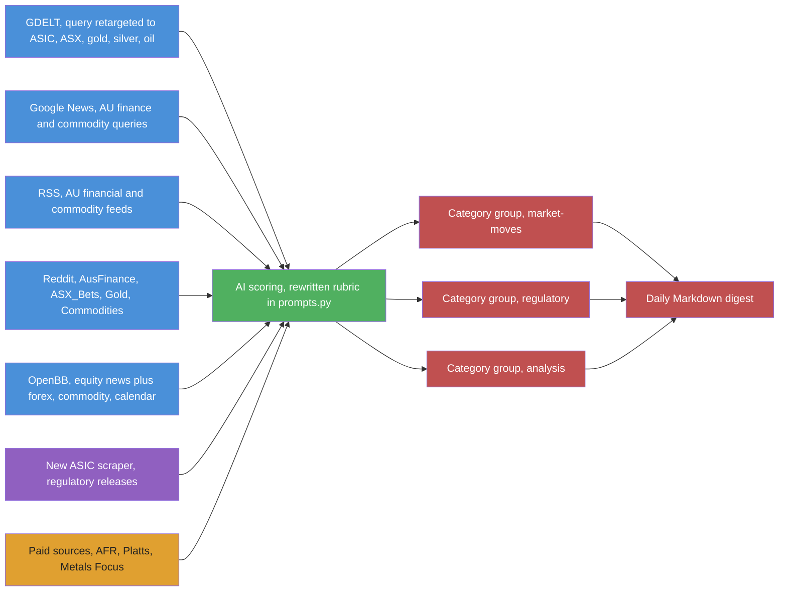
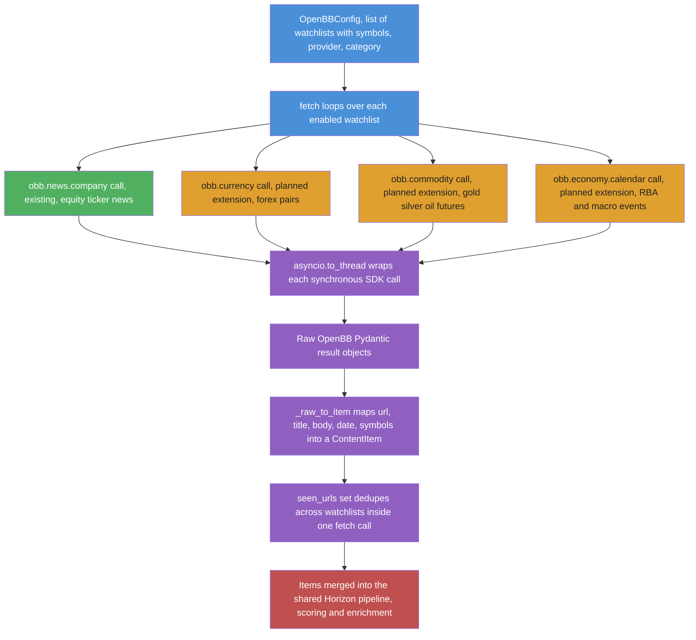
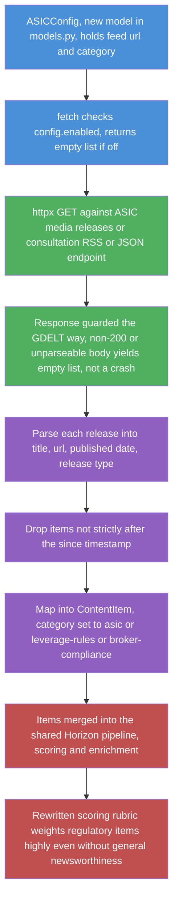
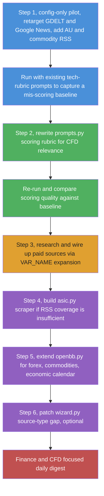

Plan: Pivoting Horizon to Sydney CFD Market & Regulatory News

**Status: planning only — nothing in this document has been implemented yet.**

## Goal

Retarget Horizon from AI/tech news aggregation to a daily briefing focused on:

1. **Sydney/ASX-area CFD market news** — price-moving events for CFD-traded instruments (ASX indices, AUD forex pairs, commodities relevant to the Australian market).
2. **Regulatory change tracking** — ASIC (Australian Securities & Investments Commission) CFD rules, leverage caps, margin requirements, broker compliance actions, and related APAC regulatory news (since ASIC CFD rules are closely watched alongside ESMA/FCA precedent).
3. **Broader financial review coverage** — sourced from existing config-driven scrapers plus new sources, including paid/subscription financial outlets where needed for depth.

This document is the result of a codebase investigation (see prior conversation) into what's config-only vs what needs code changes, extended with concrete sourcing and a phased build-out.

## Why this is a pivot, not a fork

Nothing in `src/` hardcodes "AI/tech" at the architecture level — the scrapers, dedup, storage, and output layers are topic-agnostic. The coupling is concentrated in three places:

- `src/ai/prompts.py` — scoring/enrichment rubric text (Python constants, no config override)
- `src/setup/wizard.py` — `build_config()` source-type coverage gap
- `src/scrapers/openbb.py` — financial scraper exists but is equity-news-only

Everything else is config (`data/config.json`) or new scraper modules following the existing `BaseScraper` pattern.

## Target topic model

Three category groups, mapped to `filtering.category_groups` (already a working, generic mechanism per `docs/scoring.md`):

|Group|Categories|Purpose|
|-|-|-|
|`market-moves`|`asx`, `forex-aud`, `commodities-metals`, `commodities-energy`, `indices-cfd`|Price-relevant news for CFD-traded instruments|
|`regulatory`|`asic`, `leverage-rules`, `broker-compliance`|ASIC/regulator actions, rule changes, enforcement|
|`analysis`|`broker-research`, `macro-review`, `financial-press`|Reviews, commentary, macro context|

## Source plan

### Reuse as-is (config-only retarget)

|Scraper|Change needed|Notes|
|-|-|-|
|`gdelt`|`query` → `"ASIC CFD"`, `"ASX"`, `"RBA interest rate"`, `"AUD forex"`, `"gold price"`, `"silver price"`, `"oil price WTI Brent"` (run as multiple configured queries if the scraper supports repeated source entries — check `models.py:280` cardinality)|Best existing lever for macro/regulatory event coverage; GDELT indexes global news including AU regulatory press and commodity markets|
|`google_news`|`query` → `"CFD trading Australia"`, `"ASIC margin rules"`, `"ASX 200"`, `"gold silver spot price"`, `"crude oil OPEC"`; `country: "AU"`, `ceid` set to AU/en|Mainstream financial journalism, config-only|
|`rss`|Replace existing tech feeds with AU financial + commodity RSS (see below)|Zero code change — just new feed entries|
|`reddit`|Swap `MachineLearning` etc. for `r/ASX_Bets`, `r/AusFinance`, `r/Forex`, `r/Gold`, `r/Silverbugs`, `r/Commodities`|Caution: signal-to-noise on retail trading subs is lower than tech subs; tune `min_score` up|
|`openbb`|Repoint `watchlists[].symbols` to ASX-listed tickers / AUD pairs / metals-and-energy proxy tickers (e.g. `GC=F`, `SI=F`, `CL=F` if `news.company()` accepts futures symbols) if accepted (needs empirical check — see Gaps)|Still equity-news-shaped; see code changes below for real CFD coverage|
|`twitter`|Swap handles to AU finance commentators/ASIC/RBA accounts, plus commodity-desk analysts, if Twitter scraper is enabled|Optional, lower priority|
|`github`, `hackernews`, `ossinsight`|Disable|No finance angle; HN is structurally tech-biased and can't be retargeted|

### New RSS sources to add (free, config-only)

These are standard AU financial RSS feeds — add as new entries under `sources.rss` in config, no code change:

- ASX market announcements (company announcements platform — check ASX's public feed availability)
- RBA (Reserve Bank of Australia) media releases — rate decisions are the single biggest AUD/ASX CFD driver
- AFR (Australian Financial Review) — markets section RSS (subscription may gate full text, see Paid sources below)
- Investing.com Australia / ForexLive — global FX-focused, config-only addition
- ASIC media releases RSS (regulatory actions, consultation papers, enforcement)

Commodity-specific feeds (gold, silver, oil, and other large-volume CFD-traded merchandise):

- Kitco News — gold/silver/precious metals spot price news and commentary, widely used by metals CFD traders
- World Gold Council press releases — official gold-market data and demand trends
- OilPrice.com — crude oil (WTI/Brent), natural gas, energy-sector CFD-relevant news
- EIA (US Energy Information Administration) — weekly petroleum/inventory reports, a major oil-price catalyst
- LME (London Metal Exchange) news/announcements — base metals (copper, aluminium, nickel) pricing context, relevant to broader commodities-CFD coverage
- Reuters Commodities RSS (if available) / Mining.com — diversified commodity-merchant coverage (mining majors, bulk metals, agri where CFD-relevant)

*(Exact feed URLs need verification at implementation time — RSS endpoints change and some require checking robots.txt/ToS before scraping.)*

### Paid/subscription sources (needs research + possible new integration)

The user flagged that some financial reviews and local news may require payment for full context. Candidates:

- **AFR (Australian Financial Review)** — subscription paywall; RSS may only give headlines/excerpts. Full-text would need either an API (if AFR offers one) or accepting headline-only items.
- **The Australian / Business section** — similar paywall situation.
- **Bloomberg/Reuters terminals or APIs** — enterprise pricing, likely out of scope for a personal aggregator but worth listing as an option if budget allows.
- **Morningstar / IBISWorld** — paid research, relevant for "financial reviews" angle.
- **Metals Focus / CPM Group (precious metals research)** — paid gold/silver supply-demand and price-forecast reports, used by serious metals CFD desks.
- **S&P Global Commodity Insights (Platts)** — paid oil/gas/energy and broader commodity pricing and assessment data, an industry-standard "large merchant" source for energy/commodity CFDs.

For paywalled sources, the codebase already has one reusable integration pattern: the `${VAR_NAME}` config expansion (used today for `LWN_KEY` in `config.example.json:52`) — if a source exposes an API key for full-text RSS, this is a drop-in, no-code path. This needs to be assessed per source once you know which subscriptions you're willing to pay for.

### New scraper code needed

- **ASIC regulatory feed** — if ASIC doesn't publish clean RSS, a small new scraper (`src/scrapers/asic.py`) following the `BaseScraper` pattern, similar in shape to `gdelt.py`/`google_news.py`, polling ASIC's media release / consultation pages.
- **OpenBB extension** for true CFD-relevant instrument classes — extend `src/scrapers/openbb.py` to call `obb.currency` (forex), `obb.economy.calendar` (RBA/economic calendar — directly relevant to "regulatory and macro changes"), and `obb.commodity` (gold, silver, oil, and other large-volume merchandise — OpenBB's commodity extension covers precious metals and energy futures pricing/news), alongside the existing `news.company()`. Needs new Pydantic config fields in `models.py` (current `OpenBBConfig`/`OpenBBWatchlist` assume equity-ticker semantics).

### How the OpenBB feed works today (and after extension)

`src/scrapers/openbb.py` wraps the synchronous OpenBB SDK in `asyncio.to_thread` and currently calls exactly one endpoint, `obb.news.company()`, once per configured watchlist. The diagram below shows the current path (solid styling) and the proposed forex/commodity/calendar extension (dashed-equivalent, same node style called out in the label).

Green is the call that exists in the code today. Orange are the planned additions — each needs its own thin wrapper method (mirroring `_fetch_watchlist`) plus a new `_raw_to_item`-style mapper, since the OpenBB SDK returns different result shapes per endpoint. Provider credentials (FMP, Benzinga, Polygon, etc.) are read by the OpenBB SDK from its own environment/settings, not passed through Horizon config.

### How the planned ASIC regulatory feed would work

No code exists yet. The proposed shape mirrors `gdelt.py` (a stateless poll-and-map scraper) rather than `openbb.py` (an SDK wrapper), since ASIC is just another HTTP source.

Whether ASIC needs this custom scraper at all depends on the open question below — if ASIC publishes usable RSS, the generic `rss.py` scraper handles it with zero code, and `asic.py` is unnecessary.

## Code changes required

### 1. `src/ai/prompts.py` — rewrite the scoring rubric

Current `CONTENT_ANALYSIS_SYSTEM` (lines 23-60) scores for "software engineering, AI/ML, and systems research." Replace with a rubric scoring for:

- Direct price impact on ASX indices, AUD pairs, or commodity CFDs (rate decisions, earnings surprises, geopolitical shocks)
- Precious metals and energy moves specifically — gold/silver spot price swings, central bank gold buying, oil/gas supply shocks (OPEC+ decisions, EIA inventory surprises, pipeline/refinery disruptions) — these are large-volume CFD instruments and should be scored on par with ASX/forex moves, not treated as a minor category
- Regulatory changes affecting CFD trading conditions (leverage limits, margin close-out rules, product intervention orders) — these should score high even without "newsworthiness" in a general-press sense, since they directly change what's tradeable
- Macro data releases (CPI, employment, GDP) with explicit AU/global relevance
- Broker/platform-level news (outages, compliance actions, new CFD product listings) — lower priority but relevant for an active CFD trader
- Penalize generic stock-tip / promotional content, consistent with the existing "overly promotional" low-priority tier

Also update `CONTENT_ENRICHMENT_SYSTEM` (lines 102-138) and `CONCEPT_EXTRACTION_SYSTEM` (lines 84-88) — both currently frame output for a "technically-minded reader" / "technical concepts." Reframe for a financially-literate reader needing concepts like margin, leverage, basis points, spread explained instead.

### 2. `src/setup/wizard.py` — close the source-type gap (optional, only if using the interactive wizard)

`build_config()` (lines 191-291) has no branch for `openbb`/`ossinsight`/`gdelt`/`google_news`. If hand-editing `config.json` directly, this can be skipped. If you want `horizon-wizard` to support finance setup end-to-end, add the missing `elif` branches.

### 3. `src/scrapers/openbb.py` + `models.py` — broaden beyond equity news

Add methods for forex/commodity/economic-calendar OpenBB calls; extend `OpenBBConfig` to support non-equity instrument identifiers. Requires adding OpenBB extension packages to `pyproject.toml`'s `openbb` extra (currently only `openbb-benzinga` is pinned alongside core `openbb`).

### 4. New `src/scrapers/asic.py` (if no usable RSS exists)

Follow the `gdelt.py`/`google_news.py` pattern: async fetch, parse into `ContentItem`, register in `orchestrator.py` and `models.py` (new `ASICConfig`).

## Known architecture gap (flagged, not addressed by this plan)

The pipeline is a **digest tool** — batch fetch → AI score → daily Markdown — not a real-time feed. `ContentItem` has no price/quote fields, and there's no streaming output path. This plan deliberately stays within the digest model: regulatory changes and market-moving *news* fit it well, but live price/spread data does not. If real-time price action turns out to be a hard requirement, that's a separate, much larger architectural project (new data model, new output cadence) and is out of scope here unless you decide otherwise.

## Phased implementation order (for when you're ready to build)

1. **Config-only pilot** — new `data/config.json`: retarget `gdelt`/`google_news` queries, add AU financial RSS feeds, disable `hackernews`/`ossinsight`/`github`. Run with the *existing* (unmodified) AI prompts first to get a baseline of how badly the tech-rubric mis-scores finance content.
2. **Rewrite `prompts.py`** per above — highest leverage on output quality. Re-run, compare.
3. **Research and wire up paid sources** the user is willing to subscribe to (AFR, etc.) using the `${VAR_NAME}` env-expansion pattern where the source supports key-based full-text access.
4. **Build `asic.py`** scraper for regulatory tracking if RSS isn't sufficient.
5. **Extend `openbb.py`** for forex/commodities/economic-calendar once the equity-news-only baseline proves too narrow.
6. **Patch `wizard.py`** only if interactive setup support is wanted.

## Open questions to resolve before implementation

- Which paid subscriptions are you actually willing to pay for? This determines whether step 3 is in scope at all.
- Does ASIC publish a usable RSS/API for media releases and CFD product intervention orders, or does it need scraping (different effort/legal-ToS consideration)?
- Should AUD/USD and other forex pairs be in scope from day one, or ASX-equity-CFD-first?
- Is `obb.news.company()` willing to accept forex/commodity symbols, or does broadening OpenBB require switching to different endpoints entirely? (Needs empirical SDK testing.)
- Which commodities beyond gold/silver/oil matter (natural gas, copper, agricultural CFDs)? This determines RSS/keyword breadth in `commodities-metals` and `commodities-energy` categories.
