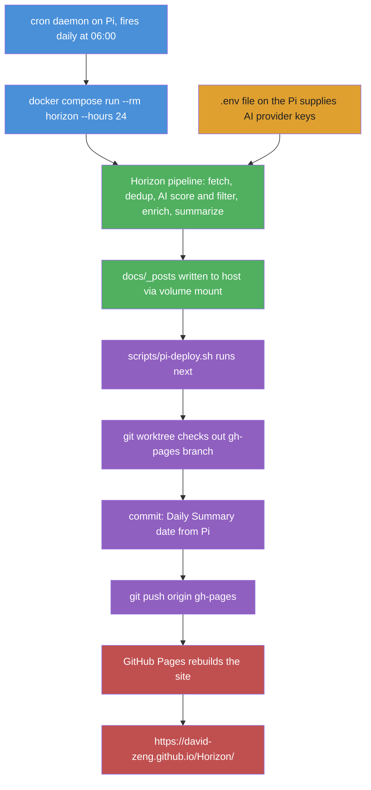

# How the daily Horizon run actually works

Confirmed by inspecting the Pi (`10.1.1.148`) crontab, `docker-compose.rpi.yml`, and `scripts/pi-deploy.sh`, and cross-checked against `gh-pages` commit history.

## Summary

- **GitHub Actions (`daily-summary.yml`) is not the source.** It has zero runs in its history and no secrets configured on the `David-Zeng/Horizon` repo.
- The real pipeline runs entirely on the **Raspberry Pi at `10.1.1.148`**, triggered by a system crontab entry, once per day at **06:00 local Pi time**.
- Every `gh-pages` commit is tagged `(from Pi)` by `pi-deploy.sh`, proving the source.

## The crontab entry (on the Pi)

```cron
0 6 * * * cd /home/pi/git_repo/Horizon && docker compose -f docker-compose.rpi.yml run --rm horizon --hours 24 && ./scripts/pi-deploy.sh >> logs/cron.log 2>&1
```

- `docker compose run --rm horizon` builds/starts the `horizon` container **on demand**, runs it to completion, then removes it (`--rm`) — this is why it never appears in `docker ps -a` outside the few minutes it's actually running.
- `--hours 24` means each run aggregates the last 24 hours of content.
- Output is piped to `logs/cron.log` on the Pi for debugging.

## Flowchart



## Key details

- **Container name**: `horizon` (set via `container_name: horizon` in `docker-compose.rpi.yml`). A second service, `horizon-scheduler`, depends on it but isn't used by the cron path above.
- **Secrets location**: API keys (AI provider, etc.) live in a `.env` file on the Pi's filesystem, read by Docker Compose — not in GitHub Actions secrets. `gh secret list` on the repo returns empty.
- **Volume mounts**: `docker-compose.rpi.yml` mounts `./data:/app/data` and `./docs:/app/docs`, so `docs/_posts/` written inside the container persists to the Pi's disk after the container exits.
- **Deploy mechanism**: `pi-deploy.sh` uses a `git worktree` to check out `gh-pages` in a temp dir, copies `docs/_posts/*` into `_posts/`, commits as `"Daily Summary: <date> (from Pi)"`, and pushes — no CI involved, GitHub Pages just rebuilds on push.
- **Safety guard**: `pi-deploy.sh` refuses to push if `origin` points at the upstream repo (`Thysrael/Horizon`), only allowing pushes to your fork.
- **Why GitHub Actions looks unused**: the workflow exists in the repo (`.github/workflows/daily-summary.yml`) as an alternative/backup path, but was never actually enabled with secrets or triggered — the Pi cron path made it redundant.
